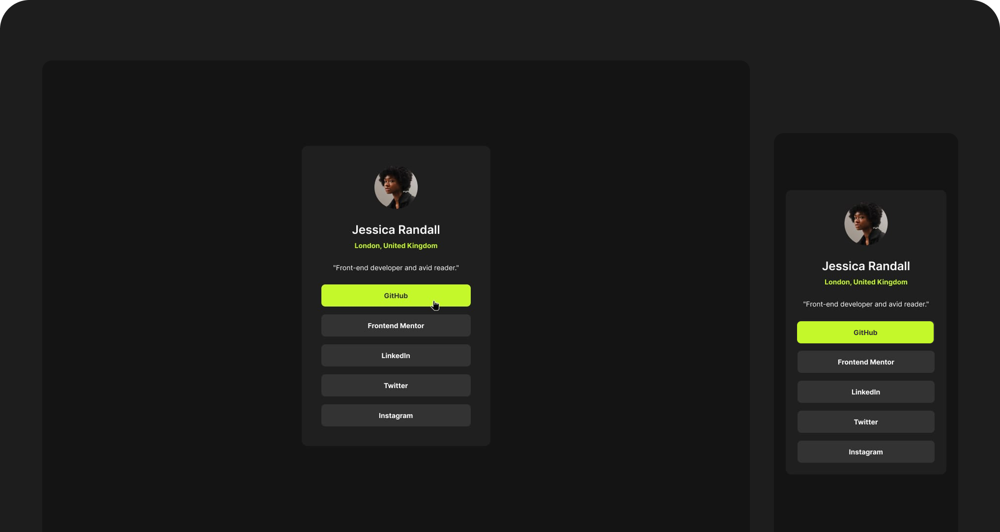

# Frontend Mentor - Social links profile solution

This is a solution to the [Social links profile challenge on Frontend Mentor](https://www.frontendmentor.io/challenges/social-links-profile-UG32l9m6dQ). Frontend Mentor challenges help you improve your coding skills by building realistic projects. 

## The challenge
git a
Users should be able to:

- See hover and focus states for all interactive elements on the page

## Screenshot

## Link

- Solution URL: [Live Site](https://mateusdmc.github.io/fm-social-links-profile/)

## My process

### Built with

- Semantic HTML5
- Flexbox
- Mobile-first
- [Tailwind CSS](https://tailwindcss.com/) - CSS framework